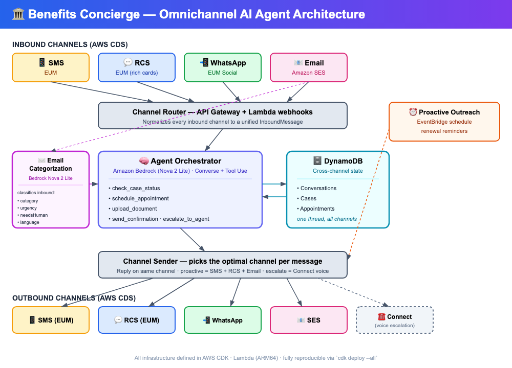

# 🏛️ Benefits Concierge — Omnichannel AI Agent for Human Services

> An agentic AI solution that transforms how government agencies communicate with benefits recipients — reaching them on the channel they prefer, picking up where the last conversation left off, and completing actions across SMS, RCS, WhatsApp, and email without ever leaving the messaging experience.

[](https://aws.amazon.com/end-user-messaging/)
[](https://aws.amazon.com/bedrock/)
[](LICENSE)

## The Problem

**42 million Americans** rely on SNAP, Medicaid, and other public assistance programs. Yet agencies communicate through paper mail that arrives weeks late, robocalls that go unanswered, and rigid IVR systems that can't answer basic questions. The result:

- **30% of eligible renewals lapse** because reminders never reach the recipient
- **$2.3B in annual administrative cost** from preventable call center volume
- Recipients wait **45+ minutes** on hold for information available in their case file

Meanwhile, these same individuals check their phones **96 times per day** and respond to text messages within **3 minutes** on average.

## The Solution

**Benefits Concierge** is an AI-powered omnichannel agent that meets recipients where they are:

```
📱 SMS Reminder          → "Your SNAP renewal is due in 14 days"
💬 RCS Rich Card         → Tap to upload documents, schedule an appointment
📲 WhatsApp Conversation → Two-way Q&A about requirements, status checks  
📧 SES Email             → Confirmation with next steps, appointment details
```

The agent maintains **a single conversation thread across all four channels** — if a recipient starts on SMS and switches to WhatsApp, the agent picks up exactly where they left off.

### Key Capabilities

| Capability | Description |
|---|---|
| **Proactive Outreach** | Automated renewal/deadline reminders via the recipient's preferred channel |
| **Channel Escalation** | SMS → RCS rich cards → WhatsApp for complex interactions |
| **Document Collection** | RCS/WhatsApp media messages for document uploads |
| **Appointment Scheduling** | Rich card carousels for location/time selection |
| **Status Inquiries** | Real-time case status checks via conversational AI |
| **Cross-Channel Continuity** | Single DynamoDB conversation state shared across all channels |
| **Multilingual Support** | Agent responds in the recipient's preferred language |

## Architecture



```
┌─────────────────────────────────────────────────────────────────────┐
│                        Benefits Concierge                           │
├─────────────────────────────────────────────────────────────────────┤
│                                                                     │
│  ┌──────────┐  ┌──────────┐  ┌──────────┐  ┌──────────┐           │
│  │   SMS    │  │   RCS    │  │ WhatsApp │  │   SES    │           │
│  │ Inbound  │  │ Inbound  │  │ Webhook  │  │ Inbound  │           │
│  └────┬─────┘  └────┬─────┘  └────┬─────┘  └────┬─────┘           │
│       │              │              │              │                 │
│       └──────────────┼──────────────┼──────────────┘                │
│                      ▼                                              │
│            ┌─────────────────┐                                      │
│            │  Channel Router  │  (API Gateway + Lambda)             │
│            │  Normalizes all  │                                      │
│            │  inbound to a    │                                      │
│            │  unified event   │                                      │
│            └────────┬────────┘                                      │
│                     ▼                                                │
│         ┌───────────────────────┐    ┌─────────────────────┐        │
│         │    Agent Orchestrator │◄──►│   Conversation DB   │        │
│         │  (Bedrock / Strands)  │    │    (DynamoDB)       │        │
│         │                       │    │  - Session state    │        │
│         │  Tools:               │    │  - Channel prefs    │        │
│         │  • check_case_status  │    │  - Message history  │        │
│         │  • schedule_appt      │    │  - Documents        │        │
│         │  • upload_document    │    └─────────────────────┘        │
│         │  • send_confirmation  │                                    │
│         │  • escalate_to_agent  │                                    │
│         └───────────┬───────────┘                                    │
│                     ▼                                                │
│            ┌─────────────────┐                                      │
│            │ Channel Sender   │                                      │
│            │ Picks best       │                                      │
│            │ channel for the  │                                      │
│            │ message type     │                                      │
│            └──┬──┬──┬──┬─────┘                                      │
│               │  │  │  │                                             │
│  ┌────────┐ ┌┴┐┌┴┐┌┴┐┌┴────────┐                                  │
│  │EUM SMS │ │R││W││S││ Connect  │                                  │
│  │        │ │C││A││E││ (voice   │                                  │
│  │        │ │S││ ││S││ escalate)│                                  │
│  └────────┘ └─┘└─┘└─┘└─────────┘                                  │
│                                                                     │
└─────────────────────────────────────────────────────────────────────┘
```

### AWS Services Used

| Service | Role |
|---|---|
| **AWS End User Messaging (EUM)** | SMS + RCS send/receive — proactive reminders, rich cards |
| **AWS End User Messaging Social** | WhatsApp — two-way conversational interactions |
| **Amazon SES** | Email — confirmations, appointment details, document receipts |
| **Amazon Bedrock** | Foundation model (Claude) for conversational AI agent |
| **AWS Lambda** | Serverless compute for all business logic |
| **Amazon DynamoDB** | Cross-channel conversation state and case data |
| **Amazon API Gateway** | Webhook ingress for all inbound channels |
| **AWS CDK** | Infrastructure as code — fully reproducible deployment |
| **Amazon Connect** | Optional voice escalation path |

## Demo

🎥 **[Watch the 3-minute demo video](https://youtu.be/PLACEHOLDER)**

The demo walks through a complete benefits renewal journey:

1. **Proactive SMS** — Recipient receives a SNAP renewal reminder
2. **RCS Rich Card** — Taps to see requirements, uploads documents via rich media
3. **WhatsApp Follow-up** — Asks questions about missing documents, gets real-time answers
4. **SES Confirmation** — Receives email with renewal confirmation and next steps
5. **Status Check** — Later texts "what's my status?" and gets an instant update across any channel

## Getting Started

### Prerequisites

- AWS Account with [AWS End User Messaging](https://docs.aws.amazon.com/sms-voice/latest/userguide/) enabled
- Node.js 20+
- AWS CDK v2
- An RCS testing agent (provisioned in ~5 minutes via the AWS Console)
- A WhatsApp Business number registered through EUM Social

### Quick Deploy

```bash
# Clone the repository
git clone https://github.com/negouseid-ttec/benefits-concierge.git
cd benefits-concierge

# Install dependencies
npm install

# Configure your environment
cp .env.example .env
# Edit .env with your AWS account details, phone numbers, and API keys

# Deploy the full stack
npx cdk bootstrap   # First time only
npx cdk deploy --all

# Provision the RCS testing agent
npm run setup:rcs

# Register your test device
npm run setup:test-device -- --phone +1XXXXXXXXXX
```

### Configuration

See [docs/configuration.md](docs/configuration.md) for detailed setup instructions including:
- RCS agent provisioning
- WhatsApp Business registration
- SES domain verification
- Bedrock model access

## Project Structure

```
benefits-concierge/
├── bin/                    # CDK app entry point
├── lib/
│   ├── stacks/             # CDK stack definitions
│   │   ├── messaging-stack.ts      # EUM (SMS/RCS) + SES resources
│   │   ├── whatsapp-stack.ts       # EUM Social (WhatsApp) resources
│   │   ├── agent-stack.ts          # Bedrock agent + Lambda orchestrator
│   │   └── data-stack.ts           # DynamoDB tables
│   ├── lambda/
│   │   ├── channel-router/         # Unified inbound message handler
│   │   ├── agent-orchestrator/     # Bedrock agent with tool definitions
│   │   ├── channel-sender/         # Outbound message dispatcher
│   │   ├── tools/                  # Agent tool implementations
│   │   │   ├── check-case-status/
│   │   │   ├── schedule-appointment/
│   │   │   ├── upload-document/
│   │   │   └── send-confirmation/
│   │   └── webhooks/               # Channel-specific webhook handlers
│   │       ├── sms-inbound/
│   │       ├── rcs-inbound/
│   │       └── whatsapp-inbound/
│   └── shared/                     # Shared types and utilities
├── test/                   # Unit and integration tests
├── docs/                   # Architecture diagrams, setup guides
├── demo/                   # Demo scripts and sample data
└── cdk.json
```

## Testing

```bash
# Run unit tests
npm test

# Run integration tests (requires deployed stack)
npm run test:integration

# Send a test SMS to trigger the full flow
npm run demo:trigger -- --phone +1XXXXXXXXXX --scenario renewal
```

## Live Deployment Evidence

The system has been **deployed and run against live AWS** — these are real AWS CDS service calls, not mocks:

### Amazon SES (email) — ✅ live, delivered
- Sent through the **deployed `bc-channel-sender` Lambda** (CloudFormation stack `BenefitsConcierge-Agent`, `CREATE_COMPLETE`) calling `@aws-sdk/client-sesv2` `SendEmailCommand`.
- Lambda invoke returned `{"success":true,"channel":"email"}`; CloudWatch logs show `[sender] Email → ...` with a clean `REPORT` (no error).
- Also runnable standalone via `demo/live/send-ses.ts` (real `MessageId` returned).

### AWS End User Messaging (SMS) — ✅ live, accepted
- Real `SendTextMessage` through `@aws-sdk/client-pinpoint-sms-voice-v2` (`demo/live/send-sms.ts`), accepted with a `MessageId`.
- Account is in the EUM **sandbox**, so the send targets the AWS **SMS simulator** (identical SDK path and metrics; no carrier delivery until sandbox exit + verified destination).

### AWS End User Messaging Social (WhatsApp) — code complete
- `@aws-sdk/client-socialmessaging` `SendWhatsAppMessage` wired in `lib/lambda/channel-sender/index.ts`; requires a registered WhatsApp Business number to fire.

### Reproduce the live sends

```bash
# SES (requires a verified SES identity + verified sandbox recipient)
AWS_PROFILE=<profile> AWS_REGION=us-east-1 \
  SES_FROM=<verified-from> SES_TO=<verified-to> \
  npx ts-node demo/live/send-ses.ts

# EUM SMS (sandbox simulator origination → simulator success destination)
AWS_PROFILE=<profile> AWS_REGION=us-east-1 \
  SMS_FROM_POOL=<simulator-number> SMS_TO=+14254147755 \
  npx ts-node demo/live/send-sms.ts

# Through the DEPLOYED Lambda (after `cdk deploy`)
aws lambda invoke --function-name bc-channel-sender \
  --payload fileb://event.json --cli-binary-format raw-in-base64-out out.json
```

## Submission Artifacts

| # | Artifact | Location |
|---|---|---|
| 1 | Code Repository | This repo |
| 2 | Architecture Diagram | [docs/architecture.png](docs/architecture.png) |
| 3 | Text Description | This README |
| 4 | Demo Video | [YouTube link](https://youtu.be/PLACEHOLDER) |
| 5 | Deployed Project URL | https://d1ggf0xtaatofn.cloudfront.net (demo UI) + deployed Lambdas (see Live Deployment Evidence) |
| 6 | ACE Opportunity ID | `OPP-XXXXXXXXX` |

## License

[MIT](LICENSE)

## Acknowledgments

Built for the [AWS CDS Agentic AI Partner Hackathon](https://aws-cds-partner.devpost.com/) (September–October 2026).
